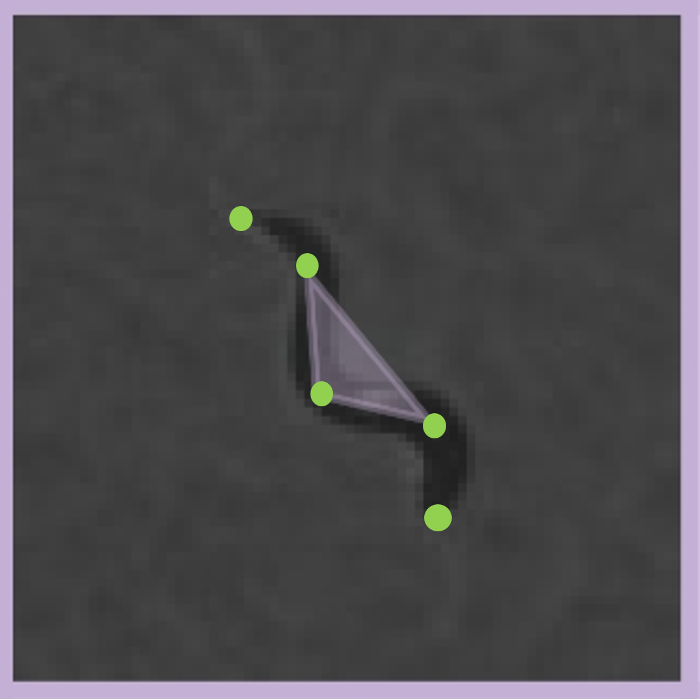
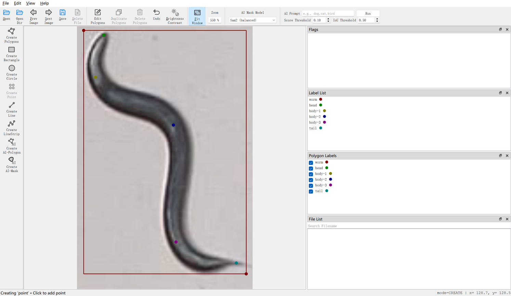

<div align="center">

# Worm-PostureNet


<p align="center">
  
</p>

[](https://www.python.org/)
[](https://github.com/ultralytics/ultralytics)
[](LICENSE)
[](https://drive.google.com/drive/folders/1R6kqE0lEfWFtJpNTTZv6d2onLVi4spOw?usp=drive_link)


An End-to-End Deep Learning Framework for High-Throughput Pose Estimation and Behavioral Profiling in Caenorhabditis elegans


</div>

---

## Overview


The system provides an automated solution for nematode pose estimation and behavioral analysis using **YOLO11-Pose** with 5 keypoints (head, 3 body segments, tail), enabling comprehensive tracking and quantification of locomotion patterns.

---

## Project Structure

```
├── ultralytics/                 # YOLO11 framework
│
├── train.py                     # Model training script
├── predict.py                   # Single image inference
├── track_modified.py            # Video tracking with trajectory visualization
├── Information-writing.py       # Tracking data extraction (frame-by-frame)
│
├── Single-worm-analysis.py      # Individual worm behavioral analysis
├── Multi-worms-analysis.py      # Population-level behavioral analysis
│
└── video2image.py               # Video frame extraction utility
```

---

## Key Features

### Keypoint-Based Pose Estimation
- **5 anatomical keypoints**: Head → Body1 → Body2 → Body3 → Tail
- YOLO11-Pose architecture for real-time detection
- Robust tracking with persistent ID assignment

### Multi-Dimensional Analysis

#### Single-Worm Analysis (`Single-worm-analysis.py`)
- **Kinematics**: Speed profiles for each body segment
- **Direction**: Body angle, movement angle, direction changes
- **Curvature**: Segmental curvature and undulation patterns
- **Behavior Classification**: Forward, backward, turn, omega-turn, pause
- **Frequency Analysis**: Undulation frequency via power spectral density

#### Population Analysis (`Multi-worms-analysis.py`)
- **Group Trajectory Visualization**: Spatial distribution and exploration patterns
- **Population Statistics**: Aggregated speed, curvature, behavioral metrics
- **Comparative Analysis**: Inter-individual variability
- **Heatmaps**: Spatial occupancy and behavioral time budgets

---

## Installation

### Prerequisites
- Python 3.8+
- CUDA 11.x compatible GPU (recommended)

### Setup

```bash
# Clone repository
git clone https://github.com/HeanLiu/Worm-PostureNet.git
cd celegans-yolo-tracking

# Install dependencies
pip install ultralytics opencv-python pandas numpy scipy matplotlib seaborn
```

**Key Dependencies:**
```txt
ultralytics>=8.0.0
opencv-python>=4.8.0
numpy>=1.24.0
pandas>=2.0.0
scipy>=1.10.0
matplotlib>=3.7.0
seaborn>=0.12.0
```

---

## Quick Start

### 1. Training

Train YOLO11-Pose using your own custom dataset(The annotation tutorial is shown below)

or kickstart your training with our publicly available dataset and pre-trained weights. 

[](https://drive.google.com/drive/folders/1R6kqE0lEfWFtJpNTTZv6d2onLVi4spOw?usp=drive_link) [](https://drive.google.com/drive/folders/1R6kqE0lEfWFtJpNTTZv6d2onLVi4spOw?usp=drive_link)

### Training Data (`data.yaml`)

YOLO pose format with 5 keypoints:

```yaml
train: datasets/train/images
val: datasets/val/images
test: datasets/test/images

nc: 1  # Number of classes (worm)
kpt_shape: [5, 2]  # 5 keypoints, (x,y) coordinates

names: ['worm']
```


**Configuration** (in `train.py`):
- Model: `yolo11s-pose.pt`
- Dataset: `data.yaml` (YOLO pose format)
- Epochs: 300
- Image size: 640
- Batch size: 16

```bash
python train.py
```

### 2. Single Image Prediction

Test the model on a single image:

```bash
python predict.py
```

**Inputs/Outputs:**
- Input: `imgs.jpg`
- Output: `outputs/_manual.jpg` (with colored keypoints)

### 3. Video Tracking

Process a video with trajectory visualization:

```bash
python track_modified.py
```

**Features:**
- Real-time tracking with persistent IDs
- Trajectory trails (last 250 frames)
- Bounding boxes and labels
- Output: `result1_track_Box.mp4`

### 4. Extract Tracking Data

Generate frame-by-frame tracking data:

```bash
python Information-writing.py
```

**Output Format** (`worm_tracking_data_wh.txt`):
```
frame  worm_id  x1  y1  x2  y2  x3  y3  x4  y4  x5  y5  w  h
1      5        120 150 125 160 130 170 135 180 140 190 8  45
```

Where:
- `(x1,y1)` = Head
- `(x2,y2)` = Body1
- `(x3,y3)` = Body2
- `(x4,y4)` = Body3
- `(x5,y5)` = Tail
- `w, h` = Bounding box width/height

---

## Keypoint Annotation Guide

### Annotation Tool

We use **[LabelMe](https://github.com/labelmeai/labelme)** for keypoint annotation. Its AI-assisted mask labeling (via SAM2) and point creation tools allow efficient and precise annotation of worm body keypoints in microscopy images.


> *Example of a labeled worm in LabelMe, showing the 5 keypoints (head → body-1 → body-2 → body-3 → tail) placed along the body midline.*

---

### Keypoint Definition

Each worm is annotated with **5 ordered keypoints** along its body axis, from head to tail:

| Index | Label | Color | Description |
|-------|-------|-------|-------------|
| KP1 | `head` |  Green | Anterior tip of the worm |
| KP2 | `body-1` |  Yellow | First body segment (~25% body length) |
| KP3 | `body-2` |  Blue | Mid-body segment (~50% body length) |
| KP4 | `body-3` |  Purple | Third body segment (~75% body length) |
| KP5 | `tail` |  Cyan | Posterior tip of the worm |

> **Important**: Keypoints must always be placed in **head-to-tail order** (KP1 → KP5). Consistent ordering is critical for downstream behavioral analysis, including direction detection and undulation phase propagation.

---

### Annotation Workflow

**Step 1 — Bounding box**
Use LabelMe's `Create AI-Polygon` or `Create Rectangle` tool to draw a tight bounding box around the entire worm body. Label this shape as `worm`.

**Step 2 — Place keypoints in order**
Use LabelMe's `Create Point` tool to place keypoints **sequentially from head to tail** (KP1 → KP5) along the worm's midline. Assign the corresponding label (`head`, `body-1`, `body-2`, `body-3`, `tail`) to each point.

**Step 3 — Determining head vs. tail orientation**
- The head is typically narrower and more pointed than the tail in brightfield microscopy.
- When orientation is ambiguous (e.g., coiled posture), use motion context from adjacent video frames to determine the direction of travel.
- If truly ambiguous, mark the keypoint visibility flag as `v=1` (labeled but uncertain) rather than `v=2` (fully visible).

**Step 4 — Handling occlusion**
- Skip worms that are more than 50% occluded or outside the field of view.
- For partially visible worms, label only the visible keypoints. Set invisible keypoints to `v=0` with coordinates `(0, 0)` during export conversion.

---

### Exporting to YOLO Pose Format

After annotation in LabelMe, convert the `.json` output files to YOLO pose `.txt` format using a conversion script. 

```bash
python json2txt.py
```

Each line in the output `.txt` file represents one worm instance:

```
<class_id> <x_c> <y_c> <w> <h>  <x1> <y1> <v1>  <x2> <y2> <v2>  ... <x5> <y5> <v5>
```

- All coordinates are **normalized to [0, 1]** relative to image width and height
- `v` (visibility) flag: `0` = not labeled, `1` = labeled but occluded, `2` = fully visible

**Example annotation line:**
```
0 0.452 0.631 0.089 0.312  0.438 0.412 2  0.441 0.498 2  0.449 0.584 2  0.453 0.670 2  0.461 0.751 2
```

---


## Behavioral Analysis

### Single-Worm Analysis

Perform comprehensive analysis on an individual worm:

```bash
python Single-worm-analysis.py
```

**Configuration:**
```python
FRAME_RATE = 2              # Video frame rate (FPS)
TARGET_WORM_ID = 10         # Worm ID to analyze
SAVE_DIR = "outputs/"       # Output directory
```

**Generated Outputs:**

1. **`worm_{ID}_trajectory.png`**
   - Movement path with time-coded colors
   - Start/end markers
   - Head direction arrows

2. **`worm_{ID}_speed_analysis.png`**
   - Center speed vs 5-point average
   - Individual keypoint speeds
   - Spatiotemporal heatmap

3. **`worm_{ID}_direction_analysis.png`**
   - Body angle over time
   - Direction change rate
   - Angular distribution (histogram + polar plot)

4. **`worm_{ID}_curvature_analysis.png`**
   - Curvature time series
   - Max Absolute Curvature vs Directed Speed correlation

5. **`worm_{ID}_behavior_stats.png`**
   - Behavior time budget (pie chart)
   - Temporal distribution
   - Speed/curvature distributions by behavior


**Extracted Features:**

| Category | Features |
|----------|----------|
| **Speed** | `center_speed`, `speed_head`, `speed_body1/2/3`, `speed_tail`, `avg_speed` |
| **Direction** | `movement_angle`, `body_angle`, `direction_change` |
| **Curvature** | `curvature`, `dominant_freq`, `power_ratio` |
| **Behavior** | `forward`, `backward`, `turn`, `omega`, `pause` |

## Utilities

### Video to Frames

Extract frames from video for dataset preparation:

```bash
python video2image.py
```

**Configuration:**
```python
video_path = "outputs/output_video_tracked-with-wh.avi"
output_dir = "outputs/frames"
save_interval = 1  # Extract every N frames
```

## Citation

If you use this code in your research, please cite:

```bibtex
@article{liu2025celegans,
  title={High-Throughput Behavioral Phenotyping Cascade Framework for C. elegans: 
         From Segmentation to Tracking and Multi-Dimensional Quantification},
  author={Liu, Xiaoke and Li, Boao and Huo, Jing and Han, Xiaoqing},
  journal={},
  year={2025},
  affiliation={Shandong Second Medical University}
}
```

---

## Acknowledgments

This work was supported by:
- **Natural Science Foundation of Shandong Province** (Grant No. ZR2024QF228, ZR2024QA176)
- **National Natural Science Foundation of China** (Grant No. 82301666)

We thank the [Ultralytics YOLO](https://github.com/ultralytics/ultralytics) team for their open-source framework.

---

## License

This project is licensed under the MIT License - see [LICENSE](LICENSE) for details.

---

## Contact

- **Corresponding Author**: Xiaoqing Han (hanxiaoqing@sdsmu.edu.cn)
- **Institution**: Shandong Second Medical University
- **Issues**: [GitHub Issues](https://github.com/HeanLiu/Worm-PostureNet/issues)

---
